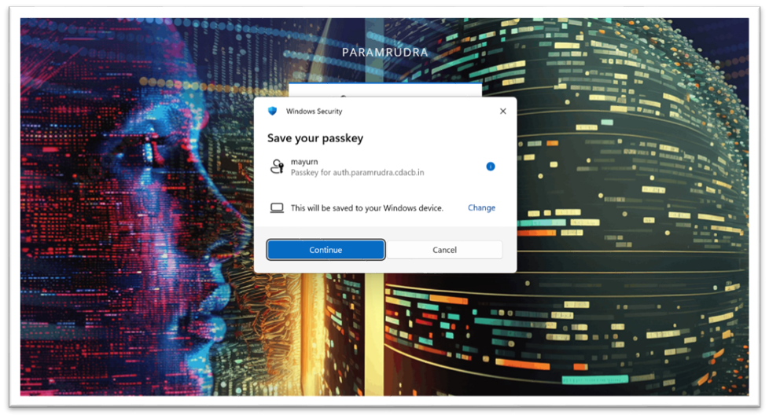
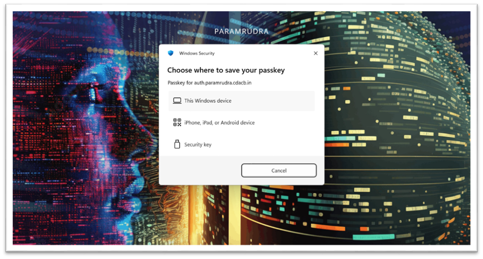
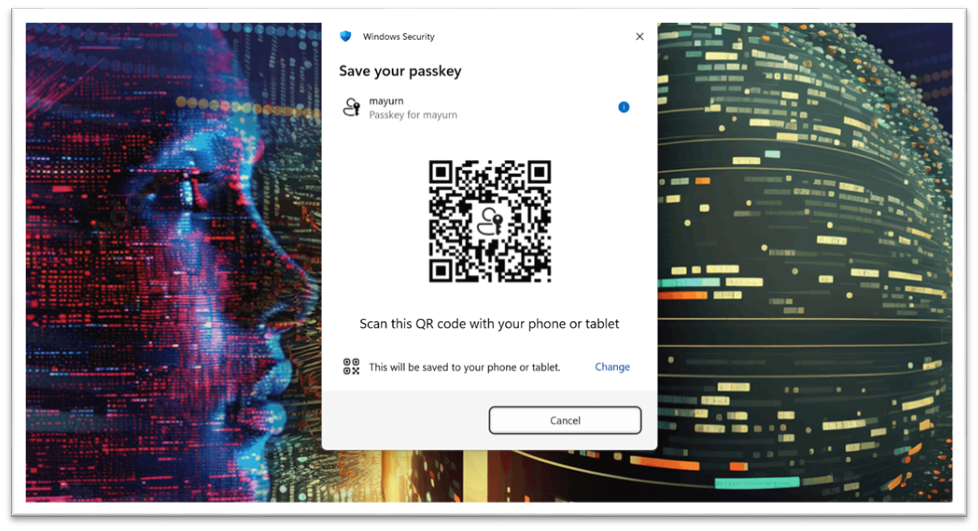
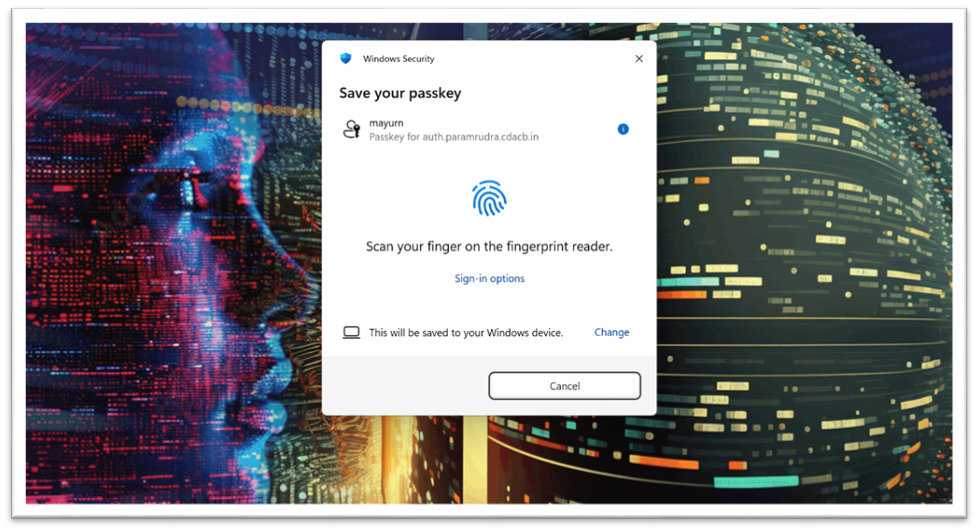
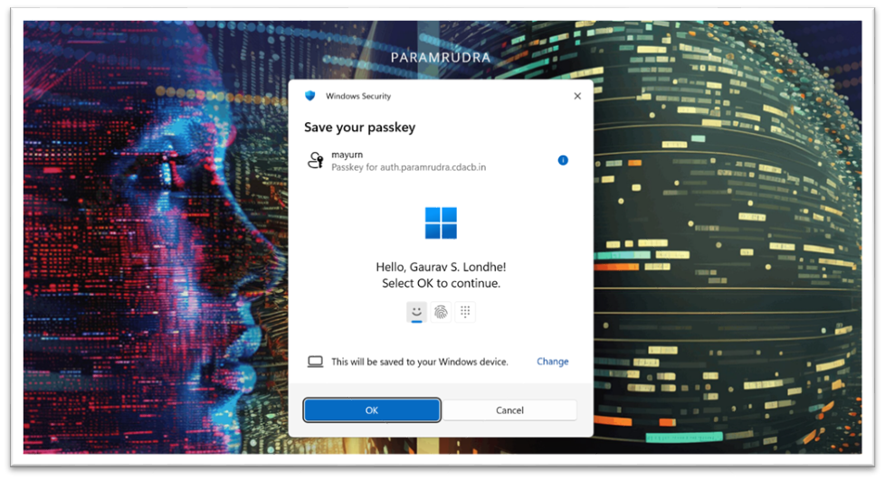
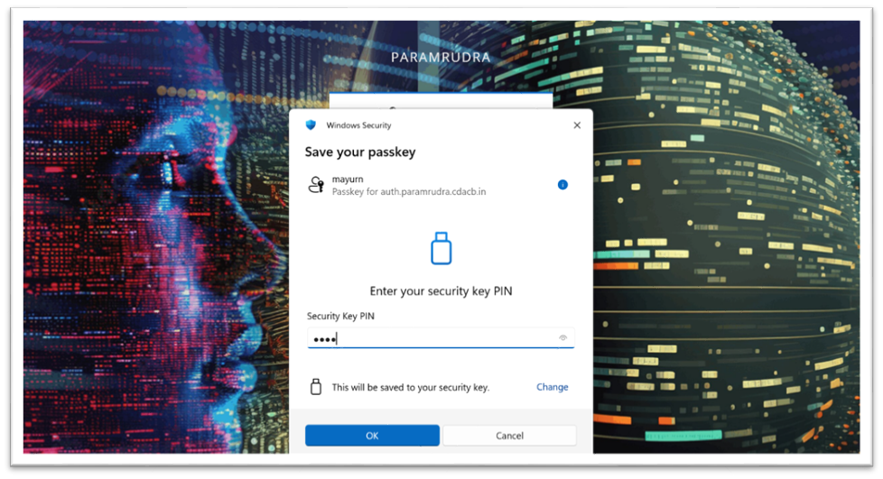
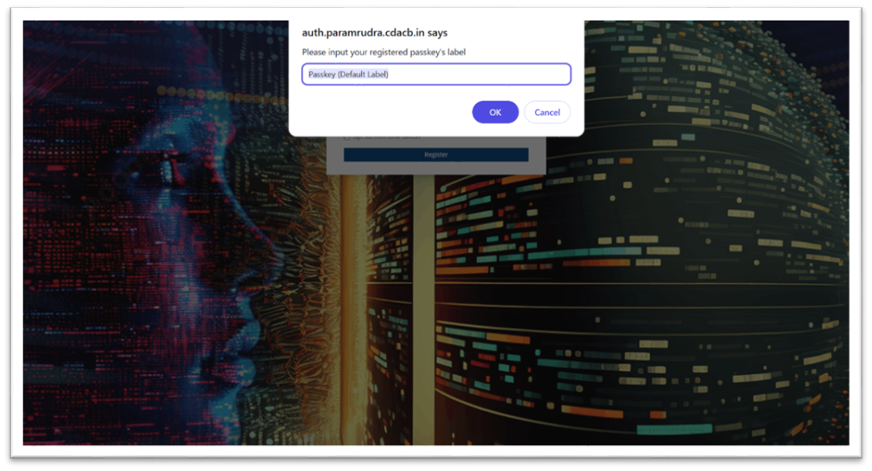
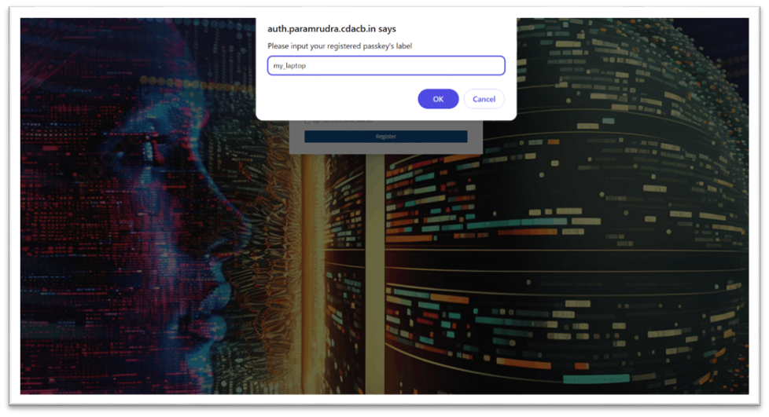
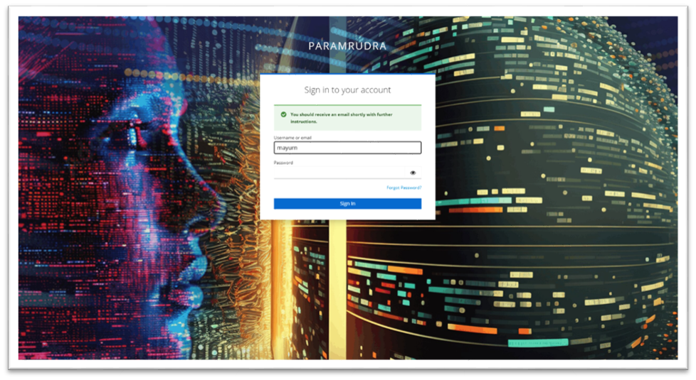

#  How to access the cluster for the first time

### (Setting up 2FA and passkeys)

### Prerequisites

Install any one of the following authenticator applications on your mobile device:

- Google Authenticator
- Microsoft Authenticator
- FreeOTP

## 1.  Access the PARAM Rudra Portal:

1.  	Open a web browser on your laptop or desktop.
2.  	Visit the PARAM Rudra Open OnDemand (OOD) portal: <https://ood.paramrudra.cdacb.in> 
3.  	Enter the temporary username and password provided by PARAM Rudra Support.
4.  	Click Sign In.

## 2.  Verify Your Email Address

1.  	After signing in with your temporary credentials, a verification email will be sent to your registered email address.
2.  	Open the email and click the email verification link.
3.  	The verification link is valid for only 5 minutes. Please complete the verification promptly.

**Important:** If the verification link expires, you may need to restart the login/ verification process from step 1.3

## 3.  Set Your Password and Configure OTP Authentication

1.  	After verifying your email, return to: https://ood.paramrudra.cdacb.in
2.  	Sign in again using your temporary credentials.
3.  	You will be prompted to set a new password.
4.  	Create a password containing at least 13 alphanumeric characters and
  minimum one special character.
5.  	On the next screen, a QR code will be displayed.
6.  	Open one of the following authenticator applications on your mobile phone:

    a.  	Google Authenticator

    b.  	Microsoft Authenticator

    c.  	FreeOTP

7.  	Scan the displayed QR code using the authenticator application.
8.  	Enter the generated OTP/verification code in the OTP field.
9.  	You may enter a device name if required. This is optional.

**Tip:** Keep your authenticator application available, as you will use it for two-factor authentication during subsequent logins.

## 4.  Register Your Device for Easier Login

1.  	To make everyday access easier, PARAM Rudra allows you to register a trusted device/passkey. Once registered, you can log in using the security method available on that device instead of entering an OTP from your mobile every time.

**Available options:**

You will be presented with the following options:

**a) This Windows device – Recommended for Windows users**

Use this option if your Windows device supports Windows Hello or Microsoft login. Depending on your device configuration, Windows Hello may use:

- Fingerprint
- PIN
- Facial recognition
- Device password

**b) iPhone, iPad, or Android device**

You can scan the QR code using your mobile device and save the passkey on your phone.
Important: Bluetooth must be enabled on both your laptop/desktop and mobile phone when using this option.

**c)  Hardware security key**

This is an optional method for users who have a compatible hardware security key.
Note: If you do not have a hardware security key, use either the Windows device or mobile device option.
 
Below are screenshots of the passkey registration steps that you will see during the registration process.

{loading=lazy}

 

{loading=lazy}
 

If you choose Phone or Tablet to save your passkey on your mobile device, open camera and scan the QR code:

{loading=lazy}
 

If you choose “This windows device”, depending on your Windows-sign in method, you may be asked to verify your identity using your fingerprint:

{loading=lazy}

Or Pin:

{loading=lazy}

Or Camera:

{loading=lazy}

If you choose “Hardware security key”, follow the on-screen instructions to register your security key. 

{loading=lazy}

1. After registering, give your passkey a name. This step is optional.

{loading=lazy}

{loading=lazy}
 

## 5.  Name and Register Your Passkey
1. After selecting your preferred device/passkey option, you may be asked to provide a name for your passkey.
2. Enter a name that helps you identify the device, for example:

    -   Office Laptop
    -   Work Desktop
-   Personal Laptop

3. Click Register.
Important: After clicking Register, wait for approximately 30 seconds for the passkey to be registered. Do not click Register again.

##  6. Complete the Registration

After the passkey registration is complete:

- If you complete the remaining activity within approximately 3 minutes, you should be taken to the PARAM Rudra login/home page.
- In some cases, you may instead see a “BAD REQUEST” page.

If you see the “BAD REQUEST” page, do not worry. Your device registration has already been completed.
Simply open the PARAM Rudra portal again:

<https://ood.paramrudra.cdacb.in>

You should now be able to access the PARAM Rudra home page.

## 7.  Access the PARAM Rudra Open OnDemand Home Page

You are now successfully registered and will see the PARAM Rudra Open OnDemand (OOD) home page.

Open OnDemand provides a convenient web-based interface for accessing and using the PARAM Rudra cluster.

For additional information about using Open OnDemand and the available cluster applications and features, please refer to the PARAM Rudra documentation.

## 8.  You are now on the main home page of OOD.

Here we are using the OpenOnDemand application for cluster access. This tool has many advantages. For more information, please go to the docs of PARAM Rudra.

For the second time onwards, you can go to the url: <https://ood.paramrudra.cdacb.in>, sign in with the username and the password you have set, and press the sign in button.

# Login Procedure for Subsequent Visits

Once your first-time registration is complete, you do not need to repeat the registration process.

For future logins:

1.  	Open a web browser.
2.  	Go to: https://ood.paramrudra.cdacb.in
3.  	Enter your username and the password you created during registration.
4.  	Click Sign In.
5.  	Complete the two-factor authentication step.

## Option 1: Login using OTP

- Google Authenticator
- Microsoft Authenticator
- FreeOTP

Enter the current OTP displayed in the application.

## Option 2: Login using Your Registered Device/Passkey

For easier everyday access, click Try Another Way.

You can then use the passkey registered on your device. Depending on your device, authentication may use:

- PIN
- Fingerprint
- Facial recognition
- Windows Hello

Another device security method configured by you

**Note:** A registered passkey works only on the device where it was registered. When accessing PARAM Rudra from another device, you may need to use OTP-based authentication or another available authentication method.

## Important Points to Remember

 Keep your PARAM Rudra username and password secure.

- The initial email verification link is valid for 5 minutes only.
- Your new password must contain at least 13 alphanumeric characters.
- Keep your authenticator application available for OTP-based authentication.
- When registering a passkey, do not click Register repeatedly. Wait approximately 30 seconds after the first click.
- A passkey registered on one device is intended for use on that specific device.
- If you see “BAD REQUEST” after passkey registration, simply reopen the PARAM Rudra portal. The registration should already be complete.

- For security, do not share your OTP, password, or passkey credentials with anyone.
- If you face any issue during the login process, please mail us on rudrasupport@cdac.in with the screenshot of the error.
- If you ever forget your password, click the "Forgot Password" text. You will see the page shown below, and a password-reset email will be sent to your registered email ID. Use that email to reset your password, then log in again by following the steps above.

{loading=lazy}

