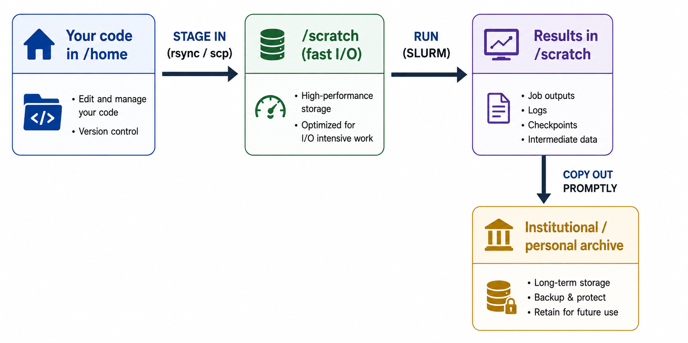

# Data Management

Good data hygiene keeps your jobs fast and your results safe. This page explains
the file systems, the `/scratch` purge policy, quotas, and efficient transfers.

## File systems

Storage is a **Lustre** parallel filesystem (10 PiB primary + 10 PiB archival)


| Path | Role | Soft quota | Backed up? | Purge | Best for |
| --- | --- | --- | --- | --- | --- |
| `$HOME` | Home — code, scripts, configs | **1 TiB** | Per site policy (keep your own copies too) | No | Small, important, permanent files |
| `$SCRATCH` | High-performance working space | **1 TiB** | **No** | **As per the policy, files stored in /scratch will be retained for only one week, after which they will be permanently deleted.** | Active job I/O, large temporary data |

!!! danger "Two rules that will save you"
    1. **`/scratch` is not storage.**As per the policy, files stored in /scratch will be retained for only one week, after which they will be permanently deleted.
    2. **Back up what you cannot regenerate.** Neither filesystem is a personal
       archive — copy important results to your institutional storage promptly.

## The recommended data lifecycle

{ loading=lazy }

1. Keep source and job scripts in `/home`.
2. Stage inputs into `$SCRATCH/<project>/<run>` and run there.
3. As soon as a run finishes, **move the outputs you need off the cluster**.
4. Delete large intermediates from `/scratch` you no longer need.

## Checking usage and quota

```bash
# Space used by your directories
du -sh $HOME           # (can be slow on large trees)
du -sh $SCRATCH

# Free space on the filesystems
df -h /home /scratch

# Quota — try in order (depends on the filesystem type)
quota -s 2>/dev/null || lfs quota -h -u $USER /scratch 2>/dev/null
```

If you hit a quota, jobs can fail to write output. Clean up or move data before
resubmitting.


!!! tip "Bundle many small files before transferring"
    Thousands of tiny files transfer slowly and stress the filesystem. Pack them
    first: `tar czf data.tar.gz data/` then transfer the single archive and
    unpack on the other side. This also helps parallel filesystems that dislike
    huge numbers of small files.

## Parallel-filesystem best practices

`/scratch` is a shared parallel filesystem. To be a good neighbour and get good
performance:

- **Avoid many-small-files workloads.** Prefer fewer, larger files; use formats
  like HDF5/NetCDF that pack data.
- **Don't `ls`/`stat` huge directories repeatedly** — metadata operations are
  expensive and slow everyone down.
- **Write from one rank or use parallel I/O (MPI-IO/HDF5)** rather than every
  rank hammering the same directory.
- **Don't poll files in tight loops** from many processes.
- **Keep job I/O in `/scratch`, not `/home`** — `/home` is for code, not
  high-throughput reads/writes.


## Housekeeping

```bash
# Find your largest directories under scratch
du -h --max-depth=1 $SCRATCH | sort -h | tail

# Find files not accessed in >80 days (candidates before the 1-week purge)
find $SCRATCH -atime +80 -type f -printf '%AY-%Am-%Ad  %p\n' 2>/dev/null | head

# Compress finished runs you still want to keep on-cluster short-term
tar czf run01.tar.gz run01/ && rm -rf run01/
```

!!! warning "`atime` and the purge"
    The purge is based on **access time**. Simply having files sit there does not
    protect them — As per the policy, files stored in /scratch will be retained for only one week, after which they will be permanently deleted. Move
    anything important **off** the cluster rather than relying on touching files.

Next: review the [Policies](policies.md) that govern fair use.
