# Debugging

## Introduction

A **debugger** or **debugging** tool is a computer program that is used to test and debug other programs (the "target" program).

When the program "traps" or reaches a preset condition, the debugger typically shows the location in the original code if it is a source-level debugger or symbolic debugger, commonly now seen in `integrated development environments.`

Debuggers also offer more sophisticated functions such as running a program step by step (single-stepping or program animation), stopping (breaking) (pausing the program to examine the current state) at some event or specified instruction by means of a breakpoint, and tracking the values of variables. 

Some debuggers have the ability to modify program state while it is running. It may also be possible to continue execution at a different location in the program to bypass a crash or logical error.

## Basics: How To

### Compilation:

Compilation with a separate flag ‘-g’ is required since the program needs to be linked with debugging symbols.

`gcc -g <program_name.c>`

e.x. gcc -g random_generator.c

### Running with gdb:

gdb is a command line utility available with almost all Linux systems’ compiler collection packgages.

`gdb <executable.out>`

e.x. gdb a.out

### Basic gdb commands (to be executed in gdb command line window):

**Start:**

Starts the program execution and stops at the first line of the main procedure. Command line arguments may be provided if any. 

**Run:**

Starts the program execution but does not stop. It stops only when any error or program trap occurs. Command line arguments may be provided if any.

**Help:**

Prints the list of commands available. Specifying ‘help’ followed by a command (e.x. ‘help run’) displays more information about that command.

**File** `<filename>:`

Loads a binary program that is compiled with ‘-g’ flag for debugging.

**List [line_no]:**

Displays the source code (nearby 10 lines) of the program in execution where the execution stopped. If ‘line_no’ is specified, it displays the source code (10 lines) at the specified line.

**Info:**

Displays more information about the set of utilities and saved information by the debugger. For example; ‘info breakpoints’ will list all the breakpoints, similarly ‘info watchpoints’ will list all the watchpoints set by the user while debugging their programs.

Print `<expression>:`

Prints the values of variables / expression at the current running instance of the program.

**Step N:**

Steps the program one (or ‘N’) instructions ahead or till the program stops for any reason. Steps through each and every instruction even if it is a function call (only function or instruction compiled with debugging flags).

**Next:**

This command also steps through the instructions of the program. Unlike the ‘step’ command, if the current source code line calls a subroutine, this command does not enter the subroutine, but instead steps over the call, in effect treating it as a single source line.

**Continue:**

This command continues the stopped program till the next breakpoint has occurred or till the end of the program. It is used to continue from a paused/debug point state.

**Break [sourcefile:]<line_no> [if condition]:**

Stops the program at the specified line number and provides a breakpoint for the user. Specific source code file and breakpoint based on a condition can also be set for specific cases. You can also view the list of breakpoints set, by using the ‘info breakpoints’ command.

**watch** `<expression>:`

A watchpoint means break the program or stop the execution of the program when the value of the expression provided is changed. Using watch command specific variables can be watched for value changes. You can also view the list of watchpoints by using the ‘info watchpoints’ command.

**Delete** `<breakpoint number>:`

Delete command deletes a breakpoint or a watchpoint that has been set by a user while debugging the program.

**Backtrace:**

Prints the backtrace of all stack frames of the program. Provides the call stack and more other information about the running program. 

These are some of the most powerful utilities that can be used to debug your programs using gdb. gdb is not limited to these commands and contains a rich set of features that can allow you to debug multi-threaded programs as well. Also, all the commands, along with the ones listed above have ‘n’ number of different variants for more in-depth control. Same can be utilized using the help page of gdb. 


## Essential gdb commands

| Command | What it does |
| --- | --- |
| `run [args]` | Start the program (stops on error/breakpoint) |
| `start` | Run and stop at the first line of `main` |
| `break <file:line>` | Set a breakpoint (`break foo.c:42`) |
| `break <line> if <cond>` | Conditional breakpoint |
| `watch <expr>` | Break when a variable/expression changes |
| `info breakpoints` / `info watchpoints` | List them |
| `continue` (`c`) | Resume to next breakpoint |
| `next` (`n`) | Step one source line, **over** function calls |
| `step` (`s`) | Step one source line, **into** function calls |
| `print <expr>` (`p`) | Show a variable/expression value |
| `list [line]` | Show nearby source |
| `backtrace` (`bt`) | Print the call stack |
| `delete <n>` | Remove a breakpoint/watchpoint |
| `help [cmd]` | Built-in help |

### Using gdb (example – inspecting the code)

For this case study, we have a small program that generates a long unique random number for each run.

Let’s look at the code we have.

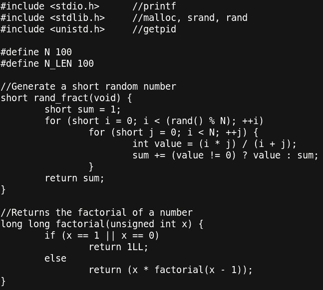{ loading=lazy }

Figure - Snapshot of debugging process 

**Things to note:**

1) We have a few libraries included for the functions that are used in the program.

2) We have two ‘#define’ statements:
 
a) ‘N’ for the number of times the ‘rand_fract’ function will spend in calculating the random number.

b)  ‘N_LEN’ for the length of the final random number string generated. Currently it is set to ‘100’ which means that the long random number will be of length 100.

3) Then, we have a function by name ‘rand_fract’ that iterates over two loops and using the values of iterators (‘i’ and ‘j’), it calculates a small random number. Since, ‘rand()’ function is used for the outer loop, its number of iterations cannot be clearly defined which gives the function a random nature.

4) The next function is as simple as its name is. It just takes an unsigned integer and returns its factorial.

PART 2:

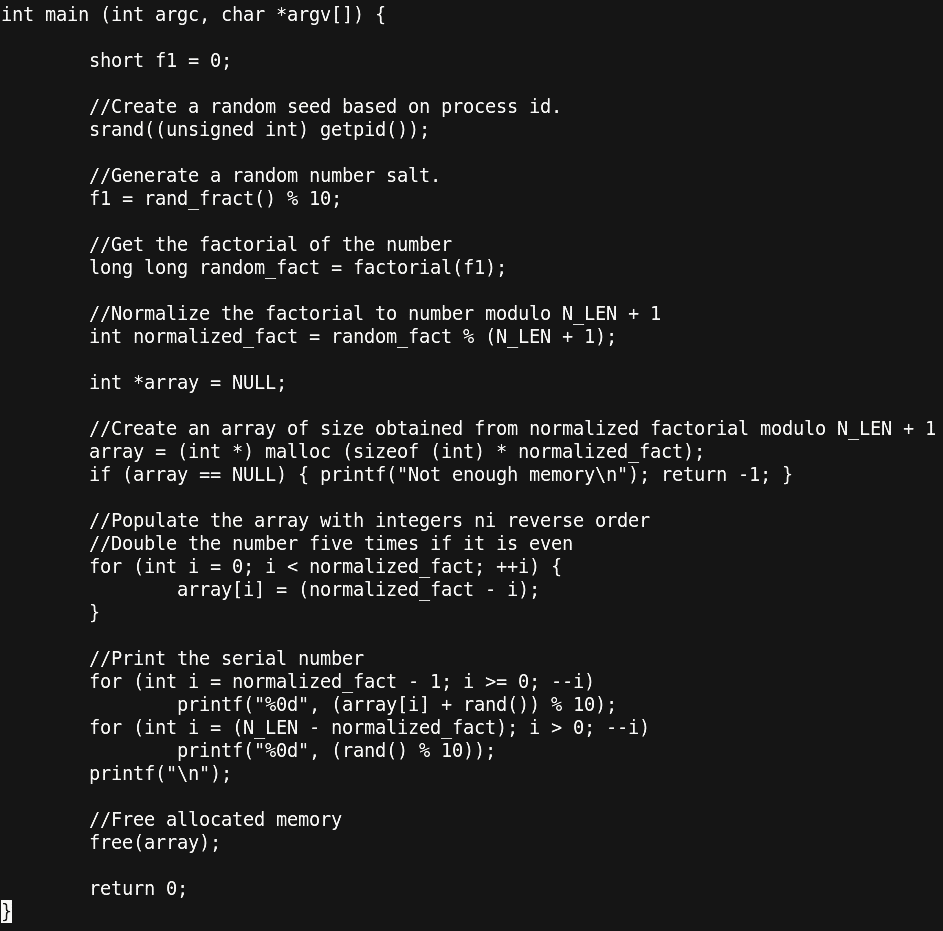{ loading=lazy }

Figure - Snapshot of debugging process 

**Things to note:**

1) This is the main function of the program.

2) The flow of the main function is as follows:

a) The program first sets a random seed using the process-id of the program.

b) It calls ‘rand_fract’ function and the resultant random number is operated by a modulo 10 operation. Finally, the result is stored in the variable ‘f1’.

c) Next the factorial of the obtained ‘f1’ is calculated and stored in ‘random_fract’.

d) This result is again passed through a modulo ‘N_LEN + 1’ and stored in ‘normalized_fact’.

e) Then a dynamic array is constructed and partially filled with integer values in descending order from the ‘normalized_fact’ value.

f) Finally, the partial array is printed by mixing the value of the array with rand() function values followed by a modulo 10 operation.

g) The remaining partial part of the final random value is generated using a basic rand() modulo 10 operation.

### Using gdb (example – using the debugger)

The code that we looked upon seems correct, as well as it compiles successfully without any errors. But, when we run this code snippet, this is the result we get.

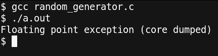{ loading=lazy }

Figure- Output at a debugging stage

The program ended up with a core dump without giving much information but just ‘Floating point exception’. Now let’s compile the code with debugging information and run the program simply with gdb.

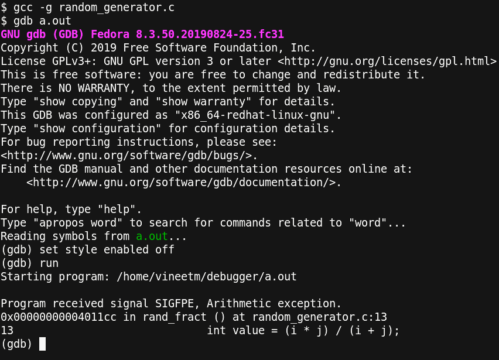{ loading=lazy }

Figure-  Snapshot of debugging process

Here we compiled the code using ‘-g’ and then used the ‘run’ command we studied earlier for running the program. You can observe that the debugger stopped at line number 13 where the ‘Floating point exception (SIGFPE)’ occurred. At this point we can even go and check the code at line number 13. But for now, let’s check what other information we can get from the debugger. Let’s check the values of the variables ‘i’ and ‘j’ at this point.

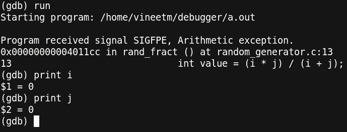{ loading=lazy }

Figure- Output depicting “Arithmetic Exception”

The values of both ‘i’ and ‘j’ appear to be ‘0’ and thus a divide by zero exception is what caused our program to terminate. Let’s update the code such that the value of ‘i’ and ‘j’ will never become ‘0’. This is the modified code:

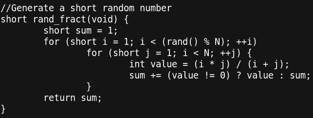{ loading=lazy }

Figure-  Snapshot of debugging process

Thus, we just updated the loop index variables to start from ‘1’ instead of ‘0’. Thus, using gdb, it was very simple to identify the point where the error occurred. Let’s re-run our updated code and check what we get.

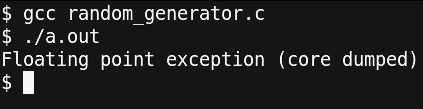{ loading=lazy}

Figure-  Well, we dumped core !!

What!? This is unexpected. We just cured the error part of our program and still getting an FPE. Let’s go through the debugger and check where the error point is right now.

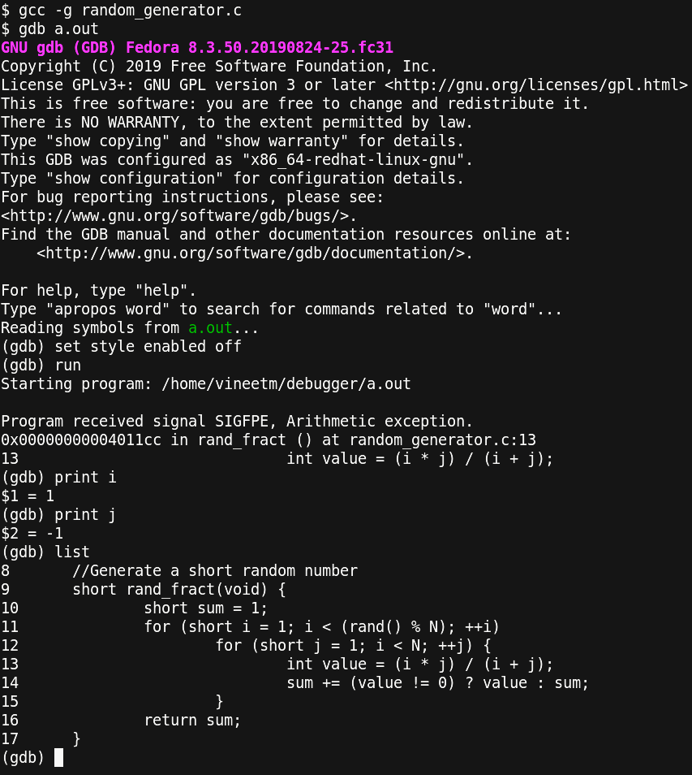{ loading=lazy }

Figure- Snapshot of debugging process

The debugger output shows that the error occurred on the same line as earlier. But in this case, the value of ‘i’ and ‘j’ are not ‘0,0’ but they are ‘1, -1’ which is causing the denominator at line 13 to be ‘0’ and thus, causing an FPE. In addition to print commands, we have also issued the ‘list’ command which shows the nearby 10 lines of the code where the program stopped.

You can observe that some bugs in the programs are easier to debug but some aren’t.

We will have to dig in much more to find out what is going on. Also, to be noted, we have our inner loop iterating from 1 to N (which is 100), but still the value of ‘j’ is printed out to be ‘-1’. How is this even possible!? Smart programmers would have the problem identified, but let’s stick to the basics on how to gdb. Let us use the ‘break’ command and set a breakpoint at line number 13 and observe what is going on.

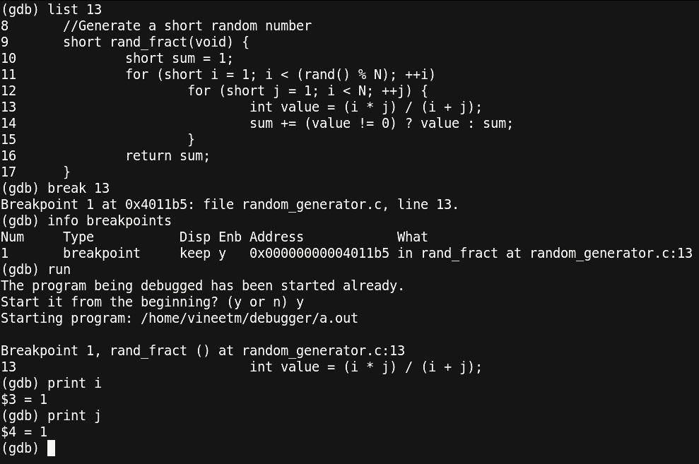{ loading=lazy }

Figure- Setting Breakpoint

Thus, using the command ‘break 13’ we have set the breakpoint at line number 13 which was verified using the ‘info breakpoint’ command. Then, we reran the program with the ‘run’ command. At line 13 the program stopped and using the ‘print’ command we checked the values of ‘i’ and ‘j’. t this point, all seems to be well. Now, let’s proceed further. For stepping 1 instruction we can use the ‘step’ command. Let’s do that and observe the value of ‘j’.

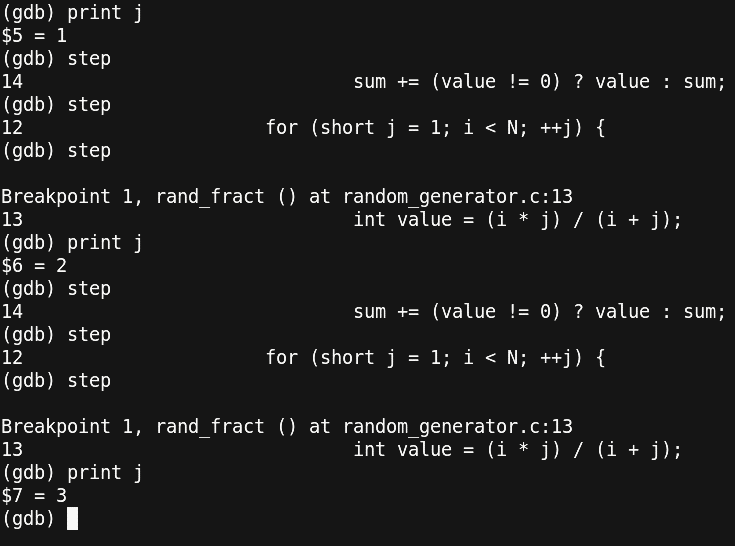{ loading=lazy }

Figure- single stepping through to catch error!!

You can observe the usage of the ‘step’ command. We are going through the program line by line and checking the values of the variable ‘j’.

There seems to be a lot of writing/typing of the ‘step’ command just to proceed with the program. Since we have already set a breakpoint at line 13, we can use another command called ‘continue’. This command continues the program till the next breakpoint or the end of the program.

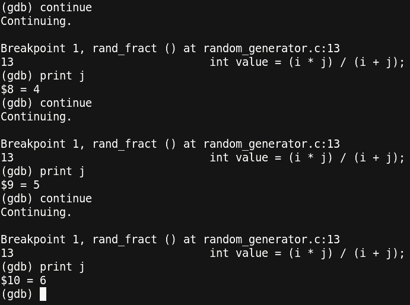{ loading=lazy }

Figure- Debugging continued

You can see that we reduced the typing of the ‘step’ command by 3 times to a ‘continue’ command just 1 time. But this is also having us write ‘continue’ and ‘print’ multiple times. Let us use some other utility in gdb known as ‘data breakpoints’ also known as watchpoints. But before that, let us delete the existing breakpoint using the ‘delete’ command.

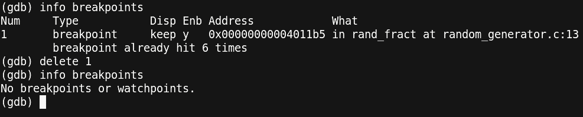{ loading=lazy }

Figure-  Debugging continued

Now let us see how to set a watchpoint.

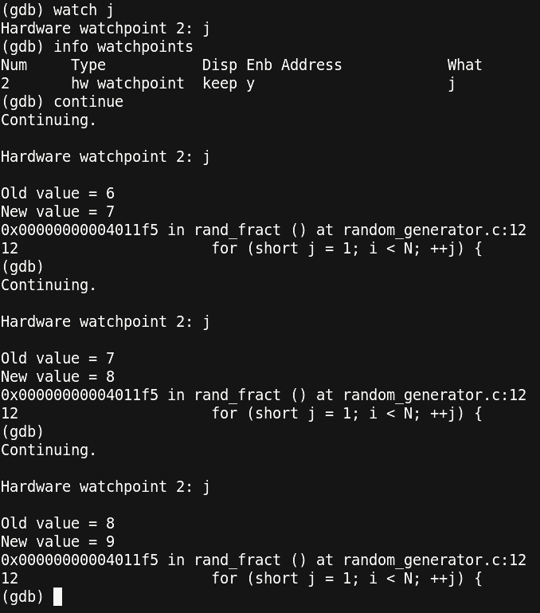{ loading=lazy }

Figure-  Setting a watchpoint

Thus, using the command ‘watch j’ we have set a watchpoint over ‘j’. Now every time when the value of ‘j’ changes, a break will occur. You can also note the old and new values of ‘j’ printed out at each break. Another point to note is that after having one ‘continue’ command, the program had a break. Further, by just pressing the ‘Enter/Return’ button on the keyboard, the continue command was repeated. Thus, by pressing the ‘Enter/Return’ button, the last command is repeated. At this point, we have learned much about the debugger, but we are still not able to proceed fast with our error. Is there any other way to proceed? Well, yes!!

We want to observe at the point where the value of ‘j’ reaches closer to ‘N i.e. 100’. Which means that we are only concerned about what happens after ‘j’ reaches 99. Here, we land up on using what are called conditional breakpoints. First, we will delete our watchpoint and then make use of the conditional breakpoint.

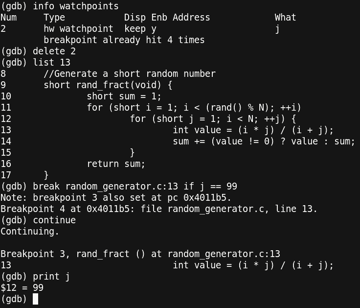{ loading=lazy }

Figure- Debugging continued

You can observe another variant of the ‘break’ command. We have explicitly stated the file and the line number along with a condition to stop. This is useful, when the source code is large and has multiple files. After setting a conditional break, we stopped at the point where the value of ‘j’ becomes ‘99’. Now, let us see what happens next. Since, this is a critical point at which we could observe the program, it is better if we step in the program using the ‘step’ command instead of relying on any break/watch points.

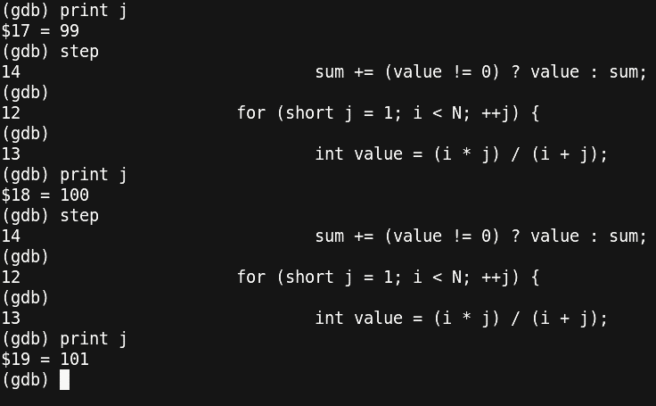{ loading=lazy }

Figure-  Well, Back to square one !!

This is unexpected!! The value of ‘j’ should never be 100 or anything above it.

Thus, something is wrong with the conditional statement!!

By observation, we have figured out that the condition is itself wrong. It should have been ‘j < N’ instead of ‘i < N’. This is a silly mistake of the programmer that led us to this much of an effort.

Also, the value of ‘j’ which was observed as ‘-1’ was an outcome of the ‘short’ data type overflow i.e. the value of ‘j’ went from 1 to 32767 (assuming short as 2 bytes) and then from -32768 to -1.

Finally, a hard programming bug was discovered. Let us correct this error and rerun the program.

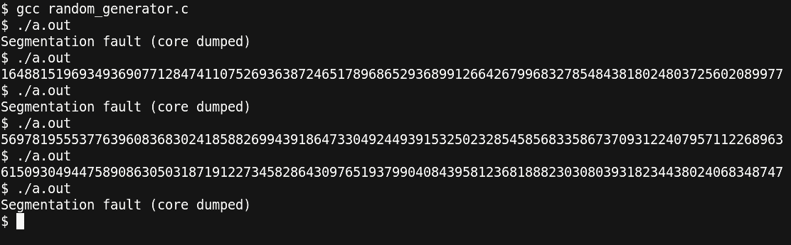{loading=lazy}

Figure- Again, Dumping Core!! Things are getting interesting or frustrating or both!!

Sometimes the program is getting the correct output, but sometimes, we are getting a segmentation fault. Debugging such a program may be tricky since the occurrence of the bug is low. We will proceed with our standard debugger steps to identify the error.

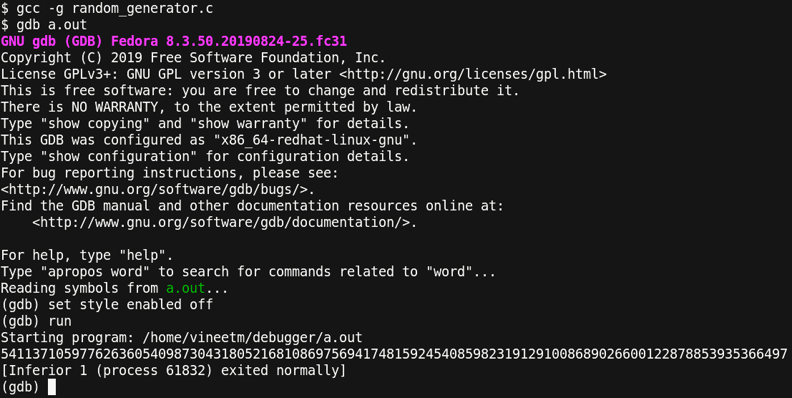{loading=lazy}

Figure-  Debugging continued

We compiled the code and ran it using the debugger. But the program completed successfully. Let us rerun it till a point where the program fails.

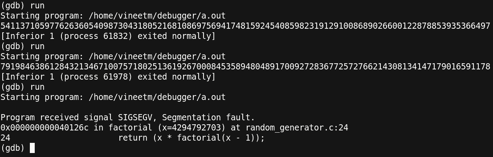{loading=lazy}

Figure- Debugging continued

Here we observe a point where the program exited at the function ‘factorial’.

This is a point where the debugger didn’t give much information about what the value of the variable ‘x’ was. It just pointed out that the program failed at the function named ‘factorial’. That’s it!

Another reason for such kind of output would be because of the recursive nature of the function. The stack frame where the function ‘factorial’ failed could be in a long nest of recursive calls. At such points, it would be better to inspect the program at an earlier point and look for errors. Let us have a breakpoint before the ‘factorial’ function was called and view the value of the parameters that are passed to the function.

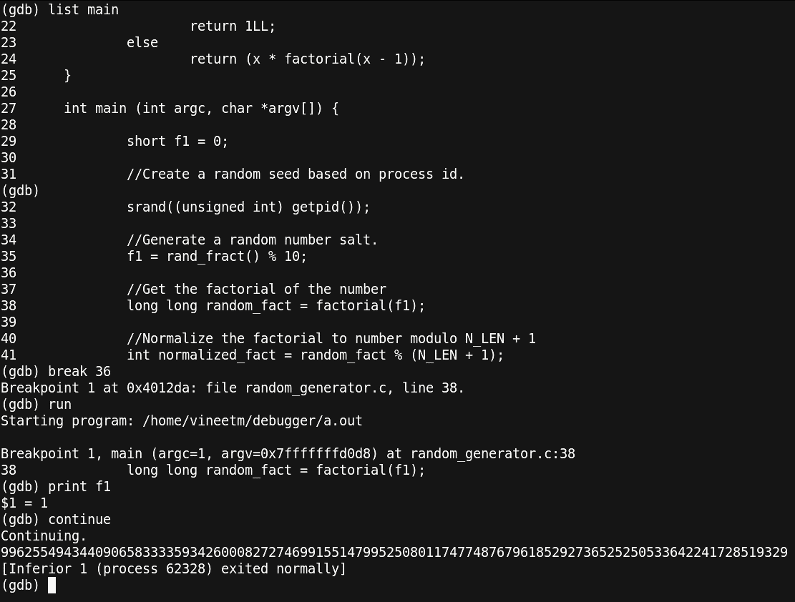{loading=lazy}

Figure- Debugging continued (Will it ever end?)

Thus, we have set a breakpoint before the call of the function ‘factorial’ and run the program. For the value of ‘f1 = 8’ for the ‘factorial’ function the process seems to exit normally. Let us rerun.

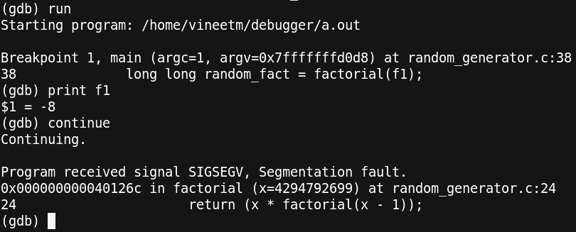{loading=lazy}

Figure-  We are almost there!!

Unexpectedly, we have got the value of ‘f1’ as ‘-8’ and the program seems to have crashed. Let us observe the ‘rand_fract’ function and ‘factorial’ function once again. And study the behavior of the functions where we could get a negative number.

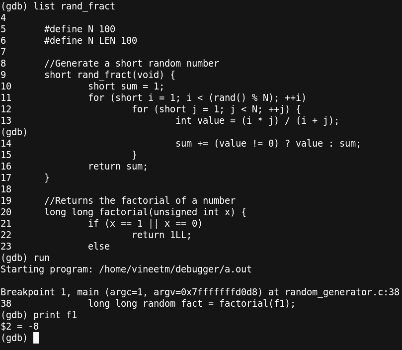{loading=lazy}

Figure- Debugging continued

Important points here to observe are:

The ‘rand_fract’ function is returning a datatype of ‘short’ while the calculation of the return value could be significantly large which may overflow the size of ‘short’, thus, causing a negative answer.

The function ‘factorial’ is expecting a value of type ‘unsigned int’. Since the value passed to the function is a negative value, having an implicit conversion from a negative number to an unsigned number means that we are having a very large value passed to the factorial function.

Also, since the ‘factorial’ function is recursive, passing a very large number to it could cause multiple calls to the same function and thus, overflowing the stack provided to the user.

Now let us step further into our program and see whether what we are discussing is the same behavior that is being observed.

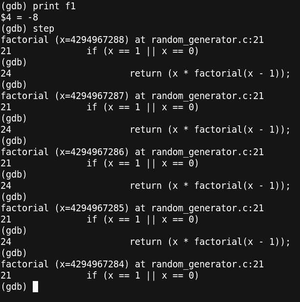{loading=lazy}

Figure-  At last, a clue!!!

This is what we had expected.

A number ‘-1’ passed to the ‘factorial’ function is being implicitly converted to a very large number ‘4294967295’.

Stepping in more reveals the recursive behavior of the ‘factorial’ function i.e. each call is having a sub call to the same function with one value less. Thus, what to do in these types of cases. Assume you have a large code where these functions are called from multiple locations.

Modifying the signature of any of the functions means changing the code everywhere where the function is called. This is not affordable. These are some cases, where a choice is to be made where patching the code is necessary for semantics of the program.

Let us observe a piece of code where this change can be made and then test our program for the expected results.

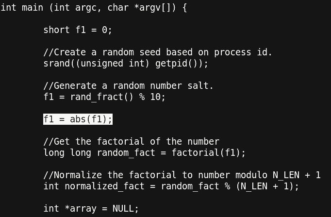{loading=lazy}

Figure- Correction applied

By observing the code, we find out that the expected value of ‘f1’ is between ‘0 to 9’ (because of the modulo 10 operation).

Thus, without changing the signature of any function, we have inserted a patch (the highlighted) portion, that maintains the semantics of the code as well cures the problem that we had. Now let us rerun and check our final program.

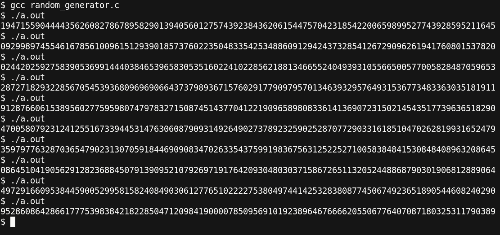{loading=lazy}

Figure-  Resolved

Thus, we are getting the correct results as expected.

### Conclusion

We started with a program that we assumed to be functional but then the program ended up with bugs that were not straightforward. We then explored the power of the debugger and the various ways to identify the bugs in our program. We looked upon the easy solutions, and slowly migrated towards the type of bugs that are not easily traceable.

Finally, we identified and corrected all the bugs in our program with the help of the debugger and arrived at a bug free code

### Points to Note

- Bugs in the program cannot be necessarily a compilation error.
- One type of error can be caused by multiple bugs in the same line of code.
- Sometimes, it is not possible to change the code even when the problem is identified. The best way to cure this is to study the behavior of the code and apply patches wherever necessary.
- Using simple utilities from the ‘GNU Debugger’ can help in getting rid of problems causing bugs in large programs.

### Overall Coding Modifications Done

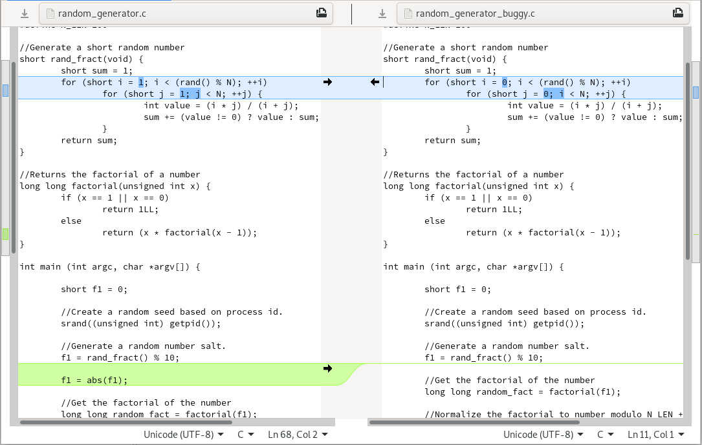{loading=lazy}

Figure-  What all we did to get things right !


Typical session:

```gdb
(gdb) break main
(gdb) run
(gdb) next
(gdb) print myvar
(gdb) watch total          # stop when 'total' changes
(gdb) continue
(gdb) backtrace            # where am I when it crashed?
```

`gdb` also debugs multi-threaded programs (`info threads`, `thread <n>`).

## Investigating job failures

Jobs stop for two common reasons: **exceeding resource limits** or
**software errors**.

1. **Always capture output.** Keep `--output`/`--error` files — don't redirect to
   `/dev/null`. They are the first place to look.
   ```bash
   #SBATCH --output=%x-%j.out
   #SBATCH --error=%x-%j.err
   ```
2. **Resource limits.** If a job exceeds its walltime or memory, SLURM kills it.
   Right-size `--time`, `--mem`, node/task counts. Check what it used:
   ```bash
   sacct -j <jobid> --format=JobID,State,Elapsed,MaxRSS,ReqMem,ExitCode
   ```
3. **Exit codes.** Any non-zero exit code marks the job `FAILED`. If a signal
   killed it, the signal number is shown after the exit code (e.g. `9:0`).
4. **Why is it pending?**
   ```bash
   scontrol show job <jobid>      # read the 'Reason' field
   ```

## Common pitfalls (from real cases)

- **Integer overflow / implicit conversions** — a value too large for its type
  (e.g. a negative `int` passed to an `unsigned`) can silently produce huge
  numbers or crashes. Watch the suspect variables and check types.
- **Uncontrolled recursion** — a bad argument can cause deep recursion and a
  **stack overflow**. `ulimit -s unlimited` in job scripts helps large legit
  stacks, but fix the root cause.
- **Endianness** — a binary data file written on a different-endian machine may
  need byte reordering; most compilers offer a conversion option.
- **Mixed compilers** — compiling different modules with different compilers
  (e.g. `pgcc` + `icc`) can cause link/runtime errors. Use one toolchain.
- **Version mismatch** — compile and run with the **same** compiler/library
  versions (load identical Spack packages in build and job scripts).

Next: [Data Management](data.md) and [Policies](policies.md).
