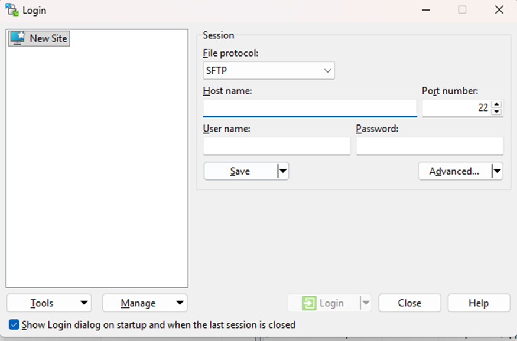
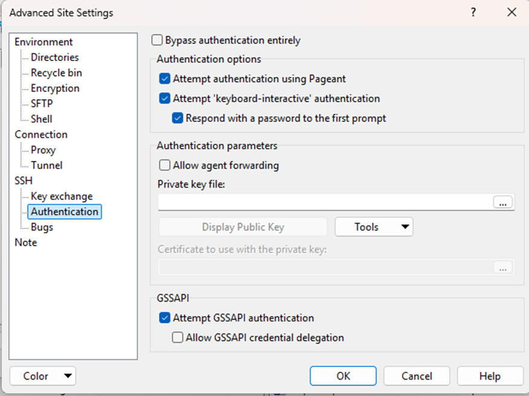
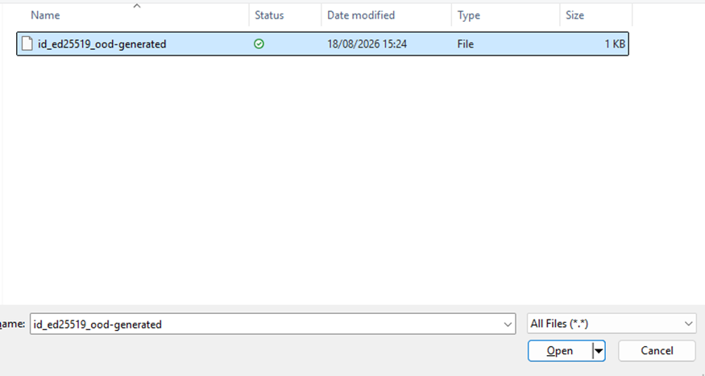
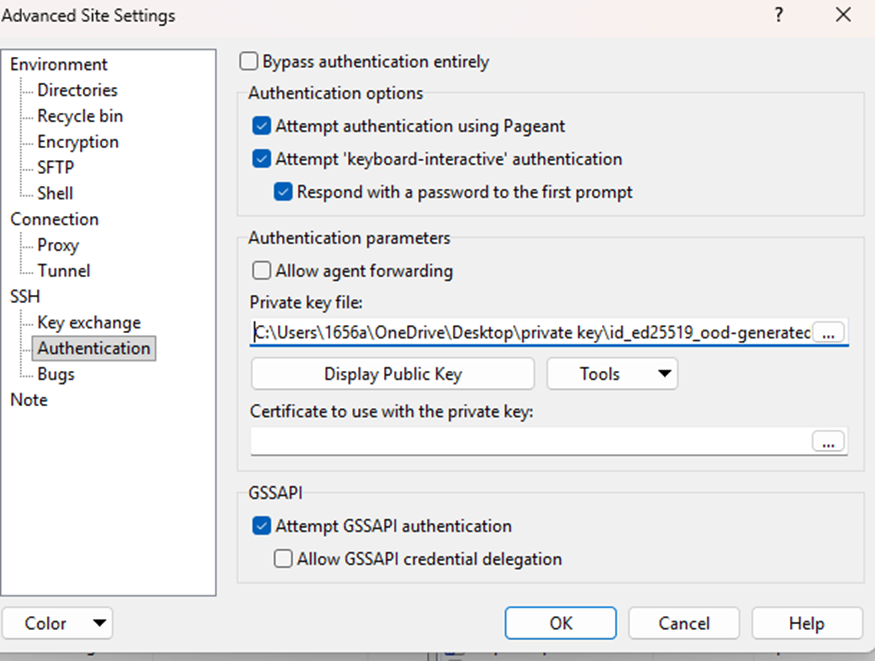
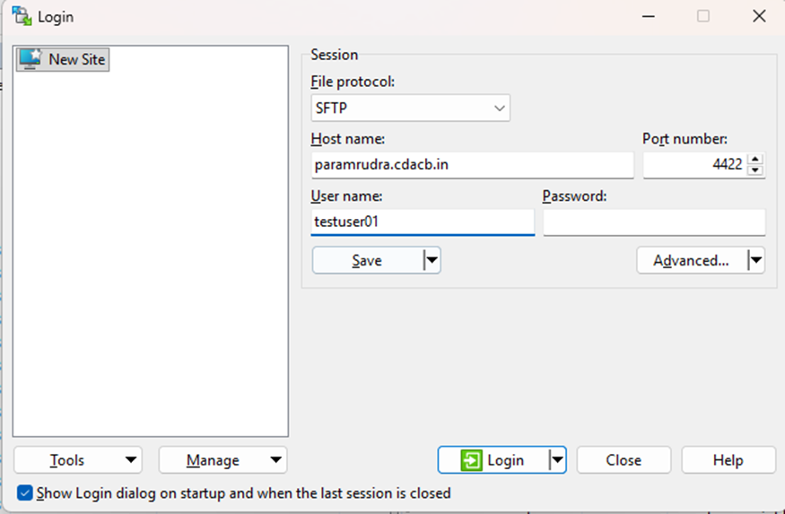
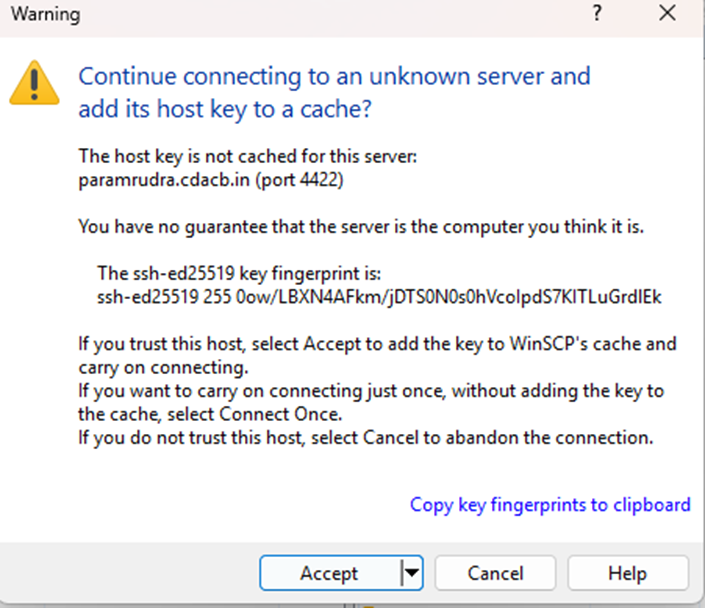
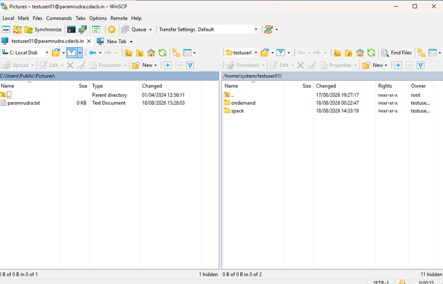

# Environment

This page covers your shell, the module system, your file systems, and the
default Conda base environment you land in.

## Your shell

The default login shell is **bash**. When you log in you will typically see a
prompt like:

```text
(base) [testuser01@login03 ~]$
```

The `(base)` prefix indicates that a **Conda base environment** is active by
default (see [Conda / Python](#conda-and-python) below).

Customise your environment through the usual bash startup files in `/home`:

- `~/.bashrc` — interactive shell settings, aliases, `module load` lines you
  want every session.
- `~/.bash_profile` — login-shell settings (often just sources `~/.bashrc`).

!!! warning "Keep startup files fast and safe"
    Avoid heavy commands, network calls, or `module load` of large stacks in
    `~/.bashrc` — they run on **every** shell, including inside every job step
    and can slow down or break batch jobs. Prefer loading modules explicitly in
    your job scripts.

## File systems

| Variable / Path | Use it for | Soft quota | Watch out for |
| --- | --- | --- | --- |
| `/home/nsmext/$USER` (`$HOME`) | Code, scripts, configs, small files | **1 TiB** | Not for heavy job I/O |
| `/scratch/$USER` | Fast working space for running jobs | **1 TiB** | **As per the policy, files stored in /scratch will be retained for only one week, after which they will be permanently deleted. |

Both live on the **Lustre** parallel filesystem. Stage inputs into `/scratch`,
run there, then copy results you want to keep back to `/home` (or off-cluster).

Recommended pattern:

```bash
# 1. Keep your code and job scripts in $HOME
cd $HOME/myproject

# 2. Stage inputs and run in /scratch (fast parallel filesystem)
mkdir -p /scratch/$USER/myproject/run01
cd /scratch/$USER/myproject/run01

# 3. After the run, move important results to safe long-term storage
```

Check your usage and quota:

```bash
# Disk usage of a directory
du -sh /scratch/$USER/*

# Lustre quota (soft: 1TiB  /home, 1TiB /scratch)
lfs quota -h -u $USER /home
lfs quota -h -u $USER /scratch
```

Grab C-DAC's worked sample programs (serial/OpenMP/MPI/CUDA/OpenACC/MKL) to get
started:

```bash
cp -r /home/apps/Docs/samples/ ~/
```

!!! danger "Back up your data"
    `/scratch` is purged and neither filesystem should be treated as an archive.
    Regularly copy results you cannot regenerate to your own institutional
    storage. See [Data Management](data.md).

## Identify where you are

```bash
hostname          # e.g. login03, cbcn0421, cbgpu0044
echo $SLURM_JOB_ID    # non-empty only inside a job
groups            # your groups / possible accounts
sacctmgr show assoc user=$USER format=account,partition -p 2>/dev/null  # your accounts
```

## Environment modules

Software is provided through **environment modules** so you can select specific
compilers, MPI libraries and applications without conflicts.

```bash
module avail                 # list everything available
module avail 2>&1 | grep -i openmpi   # search (module output goes to stderr)          
module list                  # what is currently loaded       
module purge                 # remove all modules (clean slate)
module show openmpi          # see what a module sets (paths, vars)
```

Software on PARAM Rudra is provided primarily through **[Spack](spack.md)**
(`spack load ...`), with **Environment Modules** used to enable Spack, Miniconda
and the ML/DL Conda environments:

```bash
module load spack
. /home/apps/spack/share/spack/setup-env.sh   # enable Spack (note leading dot)
spack find                                     # what's installed
```

The module system and Conda are covered on the [Modules & Conda](modules.md)
page; Spack in depth on the [Spack Packages](spack.md) page.

!!! tip "`module avail` prints to stderr"
    To search it, redirect stderr into the pipe: `module avail 2>&1 | grep -i cuda`.

## Conda and Python

You land in a Conda **base** environment (`(base)` in your prompt). Do **not**
install packages into `base` — create your own named environments instead:

```bash
# Create a project environment
conda create -n myenv python=3.11 numpy scipy
conda activate myenv

# ... work ...

conda deactivate
```

If you prefer not to start in `base` automatically:

```bash
conda config --set auto_activate_base false   # takes effect next login
```

!!! warning "Do not build Conda environments on the login node under load"
    Large `conda`/`pip` installs are I/O and CPU heavy. For big environments,
    do the install inside an [interactive job](batch.md#interactive-jobs) or a
    short batch job, and consider placing large environments under `/scratch`
    (mindful of the purge policy) rather than filling your `$HOME` quota.

See [Building Software](building.md) for compilers, MPI and CUDA, and for using
`pip`/`venv` and Julia.

## Transferring files between local machine and HPC cluster

Users need to have their data and applications related to their project or research work on PARAM Rudra. To store the data, special directories named “home” have been made available to the users. While these directories are common to all the users, each user will have their own directory with their username in the “/home/” directory, where they can store their data.

`/home/nsmext/<username>/`  This directory is generally used by the user to store their data and if needed install their own applications.
However, there is a limit to the storage provided to users. The limits have been defined according to quota over these directories, and all users will be allotted the same quota by default. When a user wishes to transfer data from their local system (laptop/desktop) to the HPC system, they can use various methods and tools.

A user using the ‘Windows’ operating system will have access to methods and tools native to Microsoft Windows, as well as tools that can be installed on their Windows machine. Linux operating system users, however, do not require any tool. They can simply use the “scp” command on 
their terminal. Here’s how:

```bash 
scp -r -P 4422 -i ~.ssh/id_rsa <path to the local data directory> <username>@paramrudra.cdacb.in:<path to directory on HPC where to save the data>

```

**Note:** use port 4422 for your system.

Use -i with the path where your private key is saved. 


**Note:** The local system (laptop/desktop) must be connected to a network that allows access to the HPC system. Additionally, please ensure that the firewall settings on your laptop are configured to allow access from the HPC system.
Users are advised to keep a copy of their data once their project or research work is completed by transferring the data from PARAM Rudra to their local system (laptop/desktop). 

## Tools

### WinSCP (Windows installable application)

Passwordless (SSH key-based) transfer from a local Windows machine to the remote cluster

To configure WinSCP on a local Windows machine to connect to the PARAM Rudra system (paramrudra.cdacb.in) over SFTP using an SSH private key instead of a password, and how to transfer files between the local machine and the remote cluster once connected.

## Prerequisites

- WinSCP installed on the local Windows machine.
- A valid SSH key pair generated for the PARAM Rudra system (e.g. id_ed25519_ood-generated), with the public key already added to ~/.ssh/authorized_keys for your account on the PARAM Rudra system.
- The private key file saved locally in a known location.
- Cluster login details: hostname paramrudra.cdacb.in, port 4422, and your cluster username (e.g. testuser01)

## Configuring the WinSCP Session

### Step 1: Open WinSCP and start a new session

Launch WinSCP. The Login window opens by default. Click “New Site”, and set the File protocol to SFTP.

{loading=lazy}

### Step 2: Open Advanced Site Settings

Click “Advanced...” in the Login window, then go to SSH → Authentication. At this point no private key file is set.

{loading=lazy}

## Step 3: Browse to the private key file

Under “Authentication parameters”, click the “...” button next to “Private key file” and browse to the key on the local machine, then select it (for example id_ed25519_ood-generated) and click Open.

{loading=lazy}

!!! Note
    WinSCP accepts OpenSSH-format keys directly. If the key is not recognized, use WinSCP's built-in PuTTYgen (Tools → Run PuTTYgen) to convert it to .ppk format first.

## Step 4: Confirm the key path

The selected private key path now appears in the “Private key file” field. Leave “Attempt ‘keyboard-interactive’ authentication” and “Respond with a password to the first prompt” enabled, then click OK to return to the Login window.

{loading=lazy}

## Step 5: Enter the host details

Back in the Login window, fill in the Session fields:

- Host name: paramrudra.cdacb.in
- Port number: 4422
- User name: your cluster username (e.g. testuser01)

Leave Password blank, since authentication happens through the private key. Optionally click “Save” to store the session for future use, then click “Login”.

{loading=lazy}

## Step 6: Accept the host key on first connection

On the first connection to a new host, WinSCP shows a warning that the server's host key is not yet cached, along with its fingerprint. Verify the fingerprint if possible, then click “Accept” to trust the host and continue connecting. This prompt will not appear on subsequent connections to the same host.

{loading=lazy}

## Step 7: Transfer files between local and remote

Once connected, WinSCP opens a dual-pane view: the local machine's file system on the left and the remote cluster's file system on the right. Navigate to the desired folder in each pane.

{loading=lazy}

To copy a file from the local machine to the cluster:

- Select the file in the left (local) pane.
- Drag it into the right (remote) pane, or right-click and choose “Upload”.

To copy a file from the cluster to the local machine, do the reverse: select the file in the right (remote) pane and drag it to the left pane, or right-click and choose “Download”.


