# How to use Open OnDemand Web Portal 

## 1. Introduction

Open OnDemand (OOD) provides a simple, browser-based interface for using the PARAM Rudra HPC System. It lets you carry out common HPC tasks without needing to know command-line tools in depth, by wrapping file management, job submission, and shell access in a single web portal.

With Open OnDemand, you can:

- Upload, download, and manage files through a graphical file browser.
- Submit, monitor, and manage computing jobs.
- Access the command-line shell on the system's login nodes, directly from the browser.
- Access and manage files in your designated storage locations.

```
Portal address
https://ood.paramrudra.cdacb.in/
```

## 2. File Locations & Storage Quotas

By default, Open OnDemand starts you in your home directory, located at:

$HOME

Here, $USER represents your own PARAM Rudra username.

You are provided with the following storage:

| **Location**        | **Quota** | **Recommended Use**                                                   |
|---------------------|-----------|------------------------------------------------------------------------|
| $HOME      | 1 TiB     | Configuration files, source code, important user data                 |
| $SCRATCH     | 1 TiB     | Temporary files, computational / job data                              |

Use your home directory for configuration files, source code, and important user data. Use scratch storage for temporary files and computational (job) data.

## 3. File Management

Open OnDemand provides a graphical file browser so you can manage files without using command-line commands.

**Step 1 — Open the file browser**

- Log in to Open OnDemand.
- Click Files in the navigation bar.
- Select the appropriate file location (e.g. Home Directory).

<br>

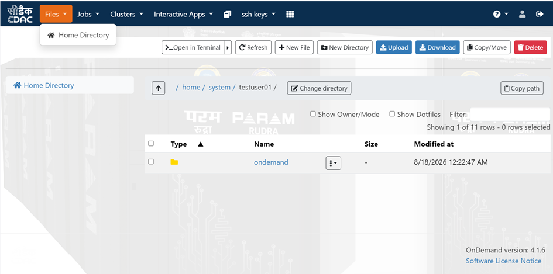{loading=lazy}
<br>
**Figure 1 — Open OnDemand file browser, showing the Home Directory view**

**Step 2 — Work with your files**

From the file browser you can:

 - Browse directories and files.
 - Create and delete files and directories.
 - Upload files from your local computer to the system.
 - Download files from the system to your local computer.
 - Perform basic file operations — Copy/Move, Delete, New Directory, New File — through the toolbar shown above.
 - Open a terminal directly in the current directory using Open in Terminal.

## 4. Submitting Jobs Through Open OnDemand

Open OnDemand provides the Job Composer to simplify creating and submitting SLURM jobs, without hand-writing a submission script from scratch.

**Step 1 — Open the Job Composer**

- Click Jobs in the navigation bar.
- Select Job Composer.

**Step 2 — Create and configure a job**

- Create a new job using one of the available sample templates.
- Configure the required job parameters, such as the number of CPUs, memory, wall time, and other resources.
- Submit the job to the SLURM scheduler.

<br>
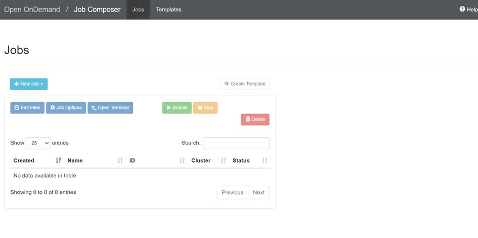{loading=lazy}

**Figure 2 — Job Composer — create, edit, submit, and monitor SLURM jobs**

The Job Composer also lets you monitor the status of submitted jobs and view details about running or completed jobs — including Created, Name, ID, system, and Status — from the Jobs list.

## 5. Accessing the PARAM Rudra Shell

Open OnDemand also provides command-line access to the PARAM Rudra system through a web-based shell, with no separate SSH client required.

**Step 1 — Open the shell**

- Click systems in the navigation bar.
- Select Login Shell Access.
- A terminal session opens in your browser and connects you to one of the system's login nodes.

You can use this shell to execute Linux commands, manage files, prepare applications, and perform other tasks that require command-line access.

**Step 2 — Shell session timeout**

!!! note
    **If the shell times out**
    
    If the shell displays a timeout or connection error, simply refresh the browser window and try again.
    
    In most cases, the shell session will reconnect successfully.


# How to access the system using Passwordless (SSH Key-Based) Access

## 1. Overview

This part explains how to set up passwordless (SSH key-based) login to the PARAM Rudra 20 PF HPC System, deployed under the National Supercomputing Mission (NSM) and hosted by C-DAC.

Once configured, you can connect directly to the system login nodes from your workstation using an SSH client (e.g. MobaXterm, PowerShell, or any terminal) without entering a password each time.

!!! note
    Two ways to set this up
    Option 1 — Generate a new SSH key pair directly on the Open OnDemand (OOD) portal and download the private key.
    Option 2 — Generate an SSH key pair on your own workstation and upload (paste) the public key into the OOD portal.

 
Both options achieve the same result. Choose Option 1 if you don't already use SSH keys and want the portal to do the work for you. Choose Option 2 if you prefer to keep your private key generated and stored only on your own machine (recommended for security-conscious users).

## 2. Prerequisites

- A valid PARAM Rudra user account (username/password issued by C-DAC) with access to the OOD portal.
- An SSH client installed on your workstation — e.g. MobaXterm (Windows), or the built-in OpenSSH client in Windows PowerShell / macOS / Linux terminal.
- Network access to ood.paramrudra.cdacb.in and paramrudra.cdacb.in (port 4422).

## 3. Log in to the OOD Portal

Open your web browser and go to: https://ood.paramrudra.cdacb.in/

Log in using your PARAM Rudra username and password. You will land on the Open OnDemand dashboard shown below.

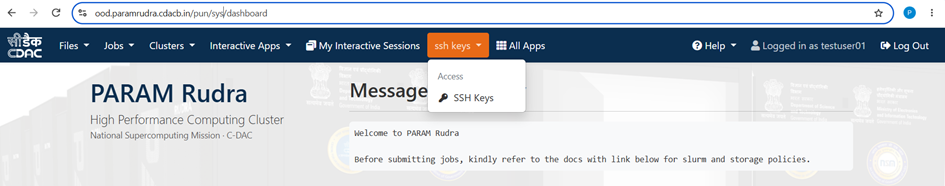{loading=lazy}

**Figure 1 — PARAM Rudra Open OnDemand (OOD) dashboard**

From the top menu bar, click **ssh keys → SSH Keys.**

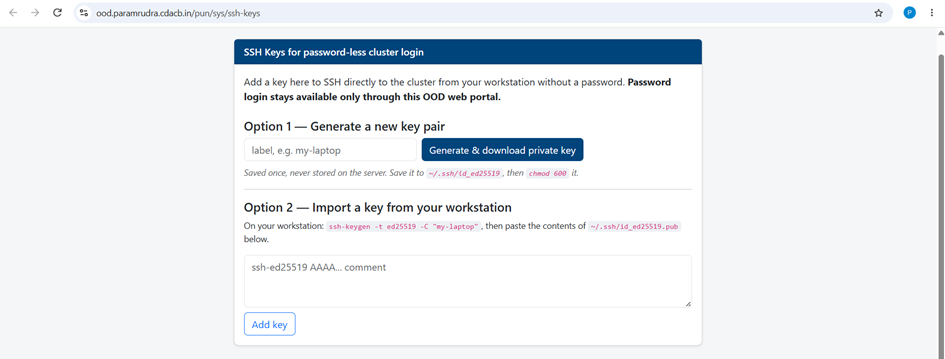{loading=lazy}

**Figure 2 — SSH Keys for password-less system login page**

!!! note 
    Password login remains available only through this OOD web portal. Direct SSH access to the system requires a key added on this page.


## 4. Option 1 — Generate a New Key Pair on the Portal

Use this option if you do not already have an SSH key pair. The portal generates the key pair for you and lets you download the private key once.

**Step 1 — Enter a label and generate the key**

In the Option 1 — Generate a new key pair section, type a short label to identify the key (e.g. my-laptop), then click Generate & download private key.

**Step 2 — Save the downloaded private key**

Your browser downloads the private key file. This is shown only once and is never stored on the server — save it immediately.

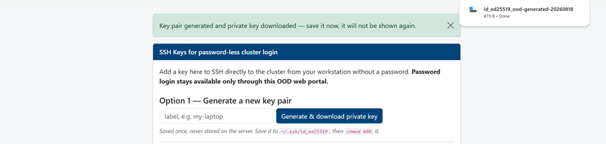{loading=lazy}

**Figure 3 — Confirmation after key generation; the private key file downloads automatically**

!!! Important
    Save the private key to ~/.ssh/id_ed25519 on your workstation, then restrict its permissions with chmod 600 ~/.ssh/id_ed25519.

**Step 3 — Move the key into MobaXterm's .ssh folder**

If you are using MobaXterm, place the downloaded key inside its SSH folder, typically C:\Users\<you>\Documents\MobaXterm\home\.ssh (mapped to /home/mobaxterm/.ssh inside MobaXterm). You may rename the file for clarity, e.g. paramrudra_id_rsa.

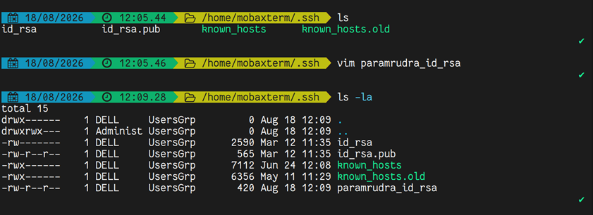{loading=lazy}

**Figure 4 — Key file placed under the MobaXterm .ssh directory**


**Step 4 — Connect using the key**

From the MobaXterm terminal (or any SSH client on the same machine), connect using the -i flag to point to your private key and -p for the system's SSH port:

```
ssh -i ~/.ssh/paramrudra_id_rsa -p 4422 testuser01@paramrudra.cdacb.in
```

Replace testuser01 with your own PARAM Rudra username.

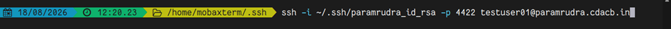{loading=lazy}

**Figure 5 — SSH connection command in MobaXterm**

On success, you will be logged directly into a PARAM Rudra login node without being prompted for a password:

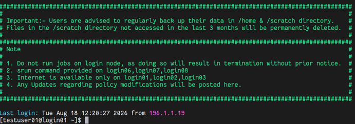{loading=lazy}

**Figure 6 — Successful passwordless login — system message of the day and shell prompt**

## 5. Option 2 — Import a Key From Your Workstation

Use this option if you'd rather generate the key pair yourself and keep the private key only on your own workstation. Only the public key is ever uploaded to the portal.

**Step 1 — Open PowerShell and generate a key pair**

On Windows, open Windows PowerShell and run:

```
ssh-keygen
```
Press Enter to accept the default file location, and optionally set a passphrase for extra security.

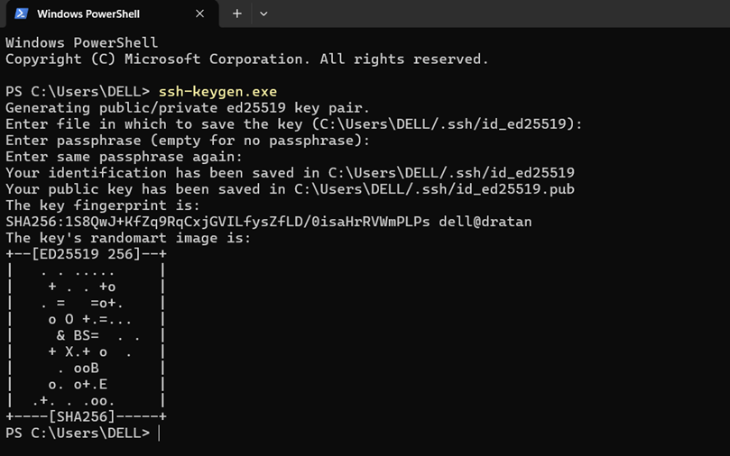{loading=lazy}

**Figure 7 — Generating an ed25519 key pair with ssh-keygen in PowerShell**

**Step 2 — Confirm the key files were created**

Run ls (or dir) inside your .ssh folder to confirm both files now exist:

!!! Key-files
    id_ed25519 ← private key (keep this secret)

    id_ed25519.pub ← public key (safe to share/upload)

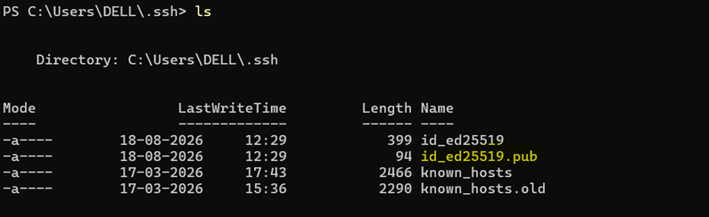{loading=lazy}

**Figure 8 — Public and private key files generated under ~\.ssh**

**Step 3 — Open and copy the public key**

Open the public key file in a text editor to copy its contents:

```
notepad .\id_ed25519.pub
```

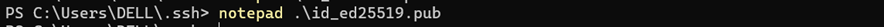{loading=lazy}

**Figure 9 — Opening the public key file in Notepad**

Select and copy the entire single line of text (it starts with ssh-ed25519 and ends with a comment):


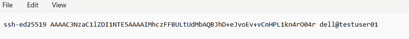{loading=lazy}

**Figure 10 — Contents of id_ed25519.pub — copy this full line**

**Step 4 — Paste the public key into the OOD portal**

Back on the SSH Keys page (Section 3), scroll to Option 2 — Import a key from your workstation, paste the copied key into the text box, then click Add key.

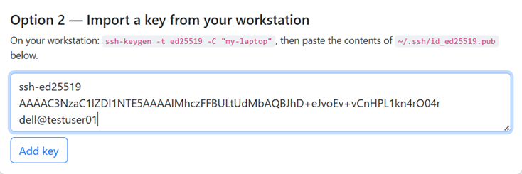{loading=lazy}

**Figure 11 — Pasting the public key contents into the portal**

The portal confirms the key was added and saved to your account's authorized keys:

{loading=lazy}

**Figure 12 — Confirmation: "Key added. You can now SSH in with it."**


**Step 5 — Connect from PowerShell**

Return to PowerShell and connect to the system using the standard ssh command with the system's port:

```
ssh testuser01@paramrudra.cdacb.in -p 4422
```
Replace testuser01 with your own PARAM Rudra username.

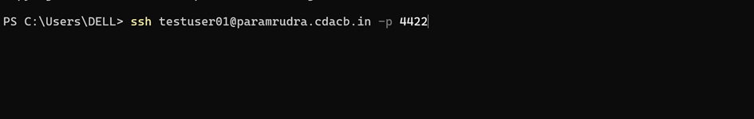{loading=lazy}

**Figure 13 — SSH connection command in PowerShell**

You will be logged in directly — no password prompt — and greeted with the system's message of the day:

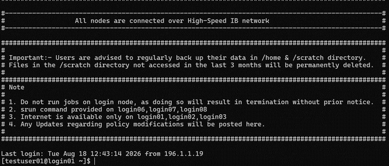{loading=lazy}

**Figure 14 — Successful passwordless login via PowerShell, showing system usage policies**

!!! note
    Please do not share your private key with anyone. Sharing it may allow unauthorized access to the system using your username and would constitute a violation of the terms and conditions of the PARAM Rudra HPC System.


